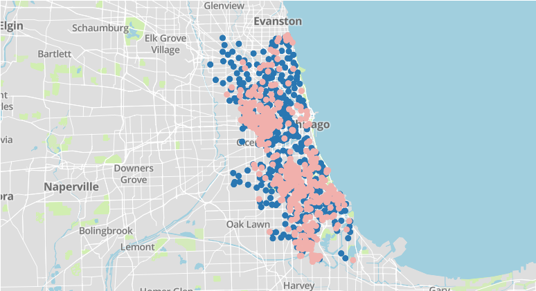
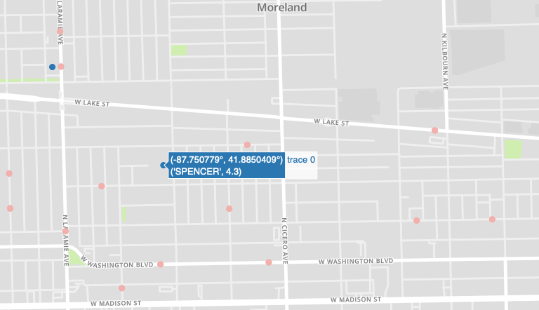

**Visualizing Chicago's Schools and Crime**

-By Connor Lockman

This is a visualization project.  It will allow you to access information about Chicago Public Schools and crime within the city.

This project makes use of two data souces. Ultimatley, the program plots where each elementary / middle school is located within the city and plots all reported homicides that have occurred across the city over the year 2018.  The goal of this project is to help visualize the proximity of Chicago's youth to crime that occurs across the city.  The plot.ly map also contains information about the schools "ranking" assigned by the Chicago Public Schools District.  

**Data Sources**
1) A large XLS file that is in the repo title "Accountability_SQRPratings_2018-2019_SchoolLevel.xls".  It contains information about every Chicago Public School within the city.
2) The program will access an api and request information about every crime within the city for 2018 (Over 200,000 instances) and will cache this information in "2018crime.csv". (https://data.cityofchicago.org/Public-Safety/Crimes-2001-to-present/ijzp-q8t2/data)

**Running This Program**
In order to effectively run this program, you will need to fork and clone this repo. You can run the program via the command line / terminal by running the project.py file.  You can do the same for the test.py file.  Before you can run the project you will need to input your credentials (see getting started section below) in the secrets.py file.

*command examples*
cd to the directory you have the repo saved and type in / run:
python project.py

python tests.py

*Note: This program may take a few minutes to run the first time, as it needs to access / cache a large amount of data. Patience is a troublesome virtue*

This image shows what the program will look like broadly when you run it.  It should automatically open in your default browser after you run the project.py file.

This image shows a zoomed in example of what the map will display.  The locations of homicides are plotted in light red and the locations of schools in dark blue.  If you hover your mouse over the school plots, it will show you the name of the school along with its CPS ranking.  The ranking criteria is as follow:

4.0 + = Level 1 + School, The highest ranking a school can get

3.5 - 3.9 = Level 1 School

3.0 - 3.4 = Level 2 + School, School needs to improve

2.0 - 2.9 = Level 2 School, School needs to improve quickly

< 2.0 = Level 3 School, Lowest ranking a school can have, at risk of being closed

**Getting Started**
You will need to set up a google places api (info about this can be found here: https://developers.google.com/places/web-service/intro) and a plot.ly account (info found here: https://plot.ly/python/getting-started/).  

You will take your unique credentials and input them in the secrets.py folder of the repo.

I've included my own credentials for the rest api that requests the crime information from the city of chicago.  Here is the api documentation if you'd like to look at it. https://dev.socrata.com/foundry/data.cityofchicago.org/6zsd-86xi

Info about socrata can be found here https://dev.socrata.com

**Dependencies**
You will need to install the following libraries to make this program work.
(Nothing too crazy)
1) sodapy
2) plotly
3) Requests
4) urllib
5) pandas
6) numpy
7) matplotlib
8) xlrd
9) csv

Info about sodapy can be found here: https://pypi.org/project/sodapy/

*You should install these libraries following your own Operating Systems instructions. For me, I used pip install on macOS.  Useful information is available in the documentation for each library about how to install these libraries for your own specific technology*
